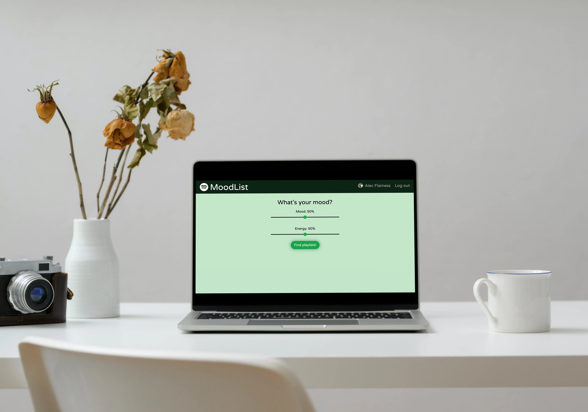

<br />
<p align="center">
  <a href="https://github.com/aflatness/MoodList"></a>

  <h2 align="center">MoodList</h2>

  <p align="center">
    Curated Spotify Playlists based on your current mood and your top 50 tracks listened to on Spotify.
    <br />
    <br />
    <a href="https://moodlist-heroku.herokuapp.com" target="_blank">View Demo</a>
    ·
    <a href="https://github.com/aflatness/MoodList/issues">Report Bug</a>
    ·
    <a href="https://github.com/aflatness/MoodList/issues">Request Feature</a>
  </p>
</p>


<!-- TABLE OF CONTENTS -->
<details open="open">
  <summary><h2 style="display: inline-block">Table of Contents</h2></summary>
  <ol>
    <li>
      <a href="#about-the-project">About The Project</a>
      <ul>
        <li><a href="#built-with">Built With</a></li>
      </ul>
    </li>
    <li>
      <a href="#getting-started">Getting Started</a>
      <ul>
        <li><a href="#prerequisites">Prerequisites</a></li>
        <li><a href="#installation">Installation</a></li>
      </ul>
    </li>
    <li><a href="#usage">Usage</a></li>
    <li><a href="#roadmap">Roadmap</a></li>
    <li><a href="#contributing">Contributing</a></li>
    <li><a href="#license">License</a></li>
    <li><a href="#contact">Contact</a></li>
    <li><a href="#acknowledgements">Acknowledgements</a></li>
  </ol>
</details>


<!-- ABOUT THE PROJECT -->
## About The Project

#### Ever have trouble finding new music that fits your current mood?

MoodList is your answer. Set what your mood and energy is, and MoodList will find a curated playlist based on your listen habits and current mood.

Preview the tracks, and if you like the, go ahead and save the private playlist to your Spotify profile and start listening in the browser.

Don't like the mix? Go ahead and try again to find new recommendations.

Don't search for new music, let MoodList do it for you.


### Built With

* [React](https://reactjs.org/)
* [React-Bootstrap](https://react-bootstrap.github.io/)
* [Spotify API](https://developer.spotify.com/)
* [Mongoose](https://mongoosejs.com/)
* [Passport](http://www.passportjs.org/)
* [Docker](https://www.docker.com/)




## Getting Started

To get a local copy up and running follow these steps.

### Prerequisites
* npm
  ```sh
  npm install npm@latest -g
  ```

### Installation

1. Clone the repo
   ```sh
   git clone https://github.com/aflatness/MoodList.git
   ```
2. Install NPM packages
   ```sh
   npm install
   ```
3. Do one of the following:
    1. Create a [MongoDB Cloud Atlas](https://account.mongodb.com/account/register) account and cluster, and set the ```process.env.MONGODB_URI``` to your connection string.
    2. Create a local MongoDB database called **MoodList**

4. Create a [Spotify API account](https://developer.spotify.com/dashboard/login), create an app, and set ```process.env.CLIENT_ID``` and ```process.env.CLIENT_SECRET``` to their respective tokens.

5. Run the following commands:
   ```sh
   npm run react-dev
   npm start
   ```


## Roadmap

See the [open issues](https://github.com/aflatness/MoodList/issues) for a list of proposed features (and known issues).


## Contributing

Contributions are what make the open source community such an amazing place to be learn, inspire, and create. Any contributions you make are **greatly appreciated**.

1. Fork the Project
2. Create your Feature Branch (`git checkout -b feature/AmazingFeature`)
3. Commit your Changes (`git commit -m 'Add some AmazingFeature'`)
4. Push to the Branch (`git push origin feature/AmazingFeature`)
5. Open a Pull Request


## License

Distributed under the MIT License. See `LICENSE` for more information.


## Contact

Alec Flatness - [@AFlatMajor4](https://twitter.com/AFlatMajor4) - aflatness@gmail.com

Project Link: [https://github.com/aflatness/MoodList](https://github.com/aflatness/MoodList)


## Acknowledgements

* [Spotify API](https://developer.spotify.com/)